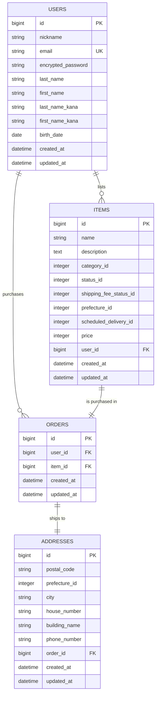

# FURIMA ER Diagram

```mermaid
erDiagram
    USERS ||--o{ ITEMS : "lists"
    USERS ||--o{ ORDERS : "purchases"
    ITEMS ||--|| ORDERS : "is purchased in"
    ORDERS ||--|| ADDRESSES : "ships to"

    USERS {
        bigint id PK
        string nickname
        string email UK
        string encrypted_password
        string last_name
        string first_name
        string last_name_kana
        string first_name_kana
        date birth_date
        datetime created_at
        datetime updated_at
    }

    ITEMS {
        bigint id PK
        string name
        text description
        integer category_id
        integer status_id
        integer shipping_fee_status_id
        integer prefecture_id
        integer scheduled_delivery_id
        integer price
        bigint user_id FK
        datetime created_at
        datetime updated_at
    }

    ORDERS {
        bigint id PK
        bigint user_id FK
        bigint item_id FK
        datetime created_at
        datetime updated_at
    }

    ADDRESSES {
        bigint id PK
        string postal_code
        integer prefecture_id
        string city
        string house_number
        string building_name
        string phone_number
        bigint order_id FK
        datetime created_at
        datetime updated_at
    }
```

## Constraints

- One user can list many items.
- One user can create many orders as a buyer.
- One item can belong to only one order.
- One order has one shipping address.
